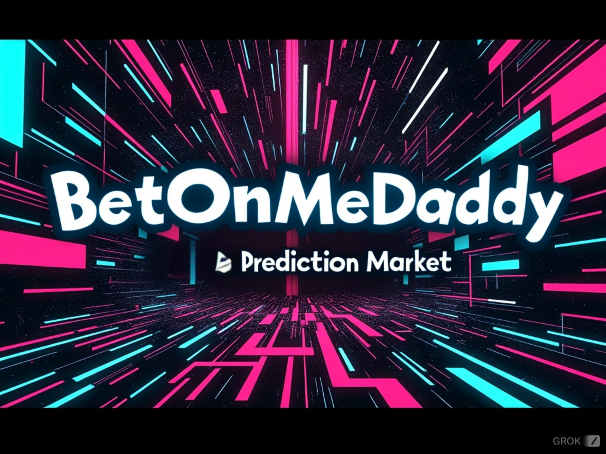
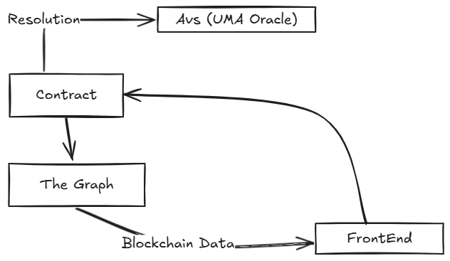

# BetOnMeDaddy

## Introduction

Bet-On-Me-Daddy plans to be a the gamififed next generation Predicition market.
The plan with BetOnMeDaddy is that we use Citra to bring bitcoin's liquidity into the evm ecosystem.
Along with this we use The graph to create a custom Graphql Api that allows us to query events from the smart contract into our app.
ALso we planned on using Eigenlayers Actively validated service to set up our own customm version of the UMA optimistic oracle and get it to work with all the services integrated together ointo one, thus allowing us to leverage all these into one.

## Arcitecture
So our app is based on 4 components 

The idea is to host all the predicition market logic on chain,the betting,the Oracle everything on chain.
